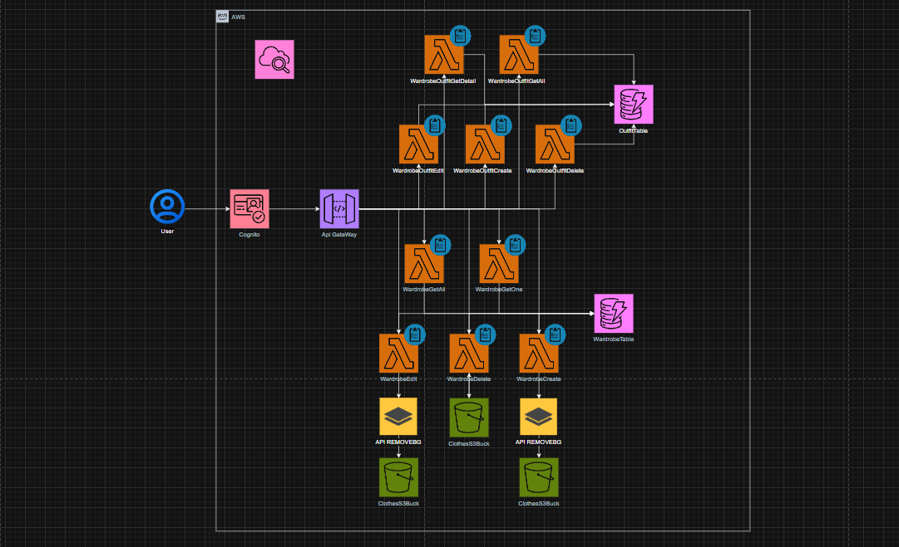

# OutfitX (Wardrobe App)


This repository contains the frontend for OutfitX — a personal wardrobe and outfit planner web application built with React + TypeScript and Vite. The app helps users store clothing items, create outfits from those items, tag/filter them, and manage their wardrobe.

---

## Badges


## Why OutfitX?

Problem solved: Many people struggle with organizing their wardrobe and planning outfits, leading to wasted time and decision fatigue. OutfitX aims to solve this problem by providing a digital solution for wardrobe management and outfit planning.

---

## Table of Contents

- [Key Features](#key-features)
- [Tech Stack](#tech-stack)
- [Setup and Installation](#setup-and-installation)
- [Architecture Overview](#architecture-overview)
  - [1. Authentication & Authorization](#1-authentication--authorization)
  - [2. API Gateway & Lambda](#2-api-gateway--lambda)
  - [3. Image Processing & Validation](#3-image-processing--validation)
  - [4. Data Layer (DynamoDB + S3)](#4-data-layer-dynamodb--s3)
  - [5. Monitoring & Logging](#5-monitoring--logging)
- [API Communication](#api-communication)
  - [Axios Configuration](#axios-configuration)
  - [Endpoints](#endpoints)
    - [Wardrobe Items](#wardrobe-items)
    - [Outfits](#outfits)
    - [Profile Management](#profile-management)
- [Pages & Routes](#pages--routes)
- [Guards](#guards)
- [AWS Docs](#aws-docs)

<!-- - [Demo Video](#demo-video) -->

---

## Project Structure

```bash
OutfitX/
├── public/                     # Public assets (images, videos, fonts)
├── src/
│   ├── assets/                  # Static assets (images, icons)
│   ├── components/              # Reusable React components
│   ├── data/                    # Mock data and constants
│   ├── hooks/                   # Custom React hooks
│   ├── pages/                   # Page components for routing
│        └── clothes/            # Wardrobe related pages
│        └── outfits/            # Outfit related pages
│   ├── guards/                  # Route guards for authentication
│   ├── types/                  # TypeScript type definitions
│   ├── utils/                   # Utility functions
│   ├── App.tsx                  # Main application component
│   ├── main.tsx                 # Application entry point
│   ├── Root.tsx                 # Root component with routing
├── .env                         # Environment variables
├── package.json                 # Project metadata and dependencies
├── tsconfig.json                # TypeScript configuration
├── vite.config.ts               # Vite configuration
└── README.md                    # Project documentation

```

---

## Key features

- User authentication (Sign up, sign in, sign out) using AWS Cognito
- Wardrobe management: CRUD operations for clothing items
- Outfit creation: Select multiple wardrobe items to create outfits
- Tagging and filtering for easy browsing
- Responsive design for desktop and mobile
- Basic error handling and loading states
- Automatic image moderation and labeling using AWS Rekognition
- Image background removal using Remove.bg API
- Secure API communication with JWT tokens via AWS API Gateway

## Tech stack

- React + Vite
- TypeScript
- Tailwind CSS
- Axios for HTTP requests
- React Router v6
- AWS Cognito for authentication
- AWS API Gateway + Lambda
- AWS DynamoDB
- AWS S3
- AWS IAM
- AWS Rekognition
- AWS CloudWatch

---

## Setup and installation

1. Clone the repository:
   ```bash
   git clone https://github.com/Victor-starr/OutfitX.git
   cd OutfitX
   ```
2. Install dependencies:

   ```bash
   npm install
   ```

3. Set up your AWS resources (Cognito User Pool, API Gateway, Lambda functions, DynamoDB tables, S3 buckets) as per the architecture.

- ⚠️ Note
  > I disabled and deleted the AWS resources used for this project after finishing development to avoid incurring charges. The deployed services referenced in this repository are no longer running or accessible.
  >
  > If you want to recreate the same AWS setup in your own account or you wanna checkout on how I have done it, please follow the instructions in `/aws/README.md`.

4. Set up environment variables:
   ```env
   VITE_AUTHORITY=https://cognito-idp.<region>.amazonaws.com/<user-pool-id>
   VITE_CLIENT_ID=<your-client-id>
   VITE_REDIRECT_URI=http://localhost:<port>/
   VITE_LOGOUT_URI=http://localhost:<port>/
   VITE_COGNITO_DOMAIN=https://<your-cognito-domain>.auth.<region>.amazoncognito.com
   VITE_API_GATEWAY_URL=https://<your-api-id>.execute-api.<region>.amazonaws.com
   ```
5. Start the development server:
   ```bash
   npm run dev
   ```
6. Open your browser and navigate to `http://localhost:5173` (or the port specified in your terminal) to access the app.

---

## Architecture Overview



### 1. Authentication & Authorization

- Users authenticate through AWS Cognito, which issues a JWT access token.
- API Gateway validates the token and forwards it to Lambda functions.
- Each Lambda extracts the user’s sub (unique Cognito ID) to securely associate actions and data with that user.

### 2. API Gateway & Lambda

- API Gateway is the single entry point for frontend requests.
- Requests are routed to purpose-built Lambda functions for clothes and outfit operations (Create, Read, Update, Delete).
- Each Lambda runs with its own IAM role following least-privilege, granting access only to required resources and actions.

### 3. Image Processing & Validation

- When creating or updating wardrobe items with images:
  - Images are first processed via the Remove.bg API to remove the background.
  - The cleaned image is analyzed by AWS Rekognition to detect inappropriate content and identify clothing categories.
  - If validation passes, the image is uploaded to S3 and metadata is recorded in DynamoDB.

### 4. Data Layer (DynamoDB + S3)

- DynamoDB holds two main tables:
  - WardrobeTable — stores clothing items and attributes (name, color, tags, category, image reference, user ID).
  - OutfitTable — stores outfits referencing multiple clothing items (one per category) linked by user ID.
- S3 stores processed images, organized by user and item ID for retrieval and management.

### 5. Monitoring & Logging

- Backend activity (API calls, Lambda executions, and errors) is tracked via AWS CloudWatch for debugging and performance monitoring.
- Lambdas and API Gateway should emit structured logs and metrics to CloudWatch to aid troubleshooting and observability.

---

## API Communication

the frontend communicates with the backend services through `RESTful API` endpoints exposed by `AWS API Gateway`. Each endpoint corresponds to specific operations for managing wardrobe items and outfits. All requests require authentication via `JWT tokens` issued by `AWS Cognito`.

### Axios Configuration

`Axios` sets up the Authorization header with the `Bearer token` for each request to ensure secure access. in my custom hooks i have made `useApi` its basic wrapper around axios to add the auth token.

### Endpoints

#### Wardrobe Items

- `GET /clothes` - Retrieve all wardrobe items that belong to the authenticated user.
- `POST /clothes/create` - Create a new wardrobe item with image processing and validation.
- `GET /clothes/{itemId}` - Retrieve details of a specific wardrobe item by its ID.
- `PUT /clothes/{itemId}` - Update an existing wardrobe item.
- `DELETE /clothes/{itemId}` - Delete a wardrobe item by its ID.

#### Outfits

- `GET /outfits` - Retrieve all outfits that belong to the authenticated user.
- `POST /outfits/create` - Create a new outfit by selecting multiple wardrobe items.
- `GET /outfits/{outfitId}` - Retrieve details of a specific outfit by its ID.
- `PUT /outfits/{outfitId}` - Update an existing outfit.
- `DELETE /outfits/{outfitId}` - Delete an outfit by its ID.

### Profile Management

- `DELETE /profile` - Delete the authenticated user's profile and all associated data.

---

# Pages & Routes

- `/` - Home page displaying wardrobe items and outfits.
- `/auth/cognito-login` — Cognito hosted sign-in page
- `/auth/cognito-logout` — Cognito hosted sign-out page
- `/wardrobe` - Wardrobe management page for CRUD operations on clothing items.
- `/wardrobe/:itemId` - Detailed view and edit page for a specific wardrobe item.
- `/wardrobe/create` - Page for adding a new wardrobe item.
- `/wardrobe/:itemId/edit` - Page for editing an existing wardrobe item.
- `/outfits` - Outfit management page for creating and viewing outfits.
- `/outfits/:outfitId` - Detailed view and edit page for a specific outfit.
- `/outfits/create` - Page for creating a new outfit.
- `/*` - 404 Not Found page for undefined routes.

# Guards

## Authentication Guard

- Protects routes that require user authentication.
- Redirects unauthenticated users to the Cognito hosted sign-in page.

## Guest Guard

- Prevents authenticated users from accessing routes meant for guests (e.g., sign-in page).
- Redirects authenticated users to the home page or dashboard.

---

# AWS Docs

> Documentation for AWS services used in the project.

- [AWS Cognito Documentation](./aws/README.md)

---

<!-- # Demo Video
> A demo video showcasing the OutfitX application features and functionality.
[Demo Video](demo_video.mp4)  -->

Victor Starr &copy; 2024
