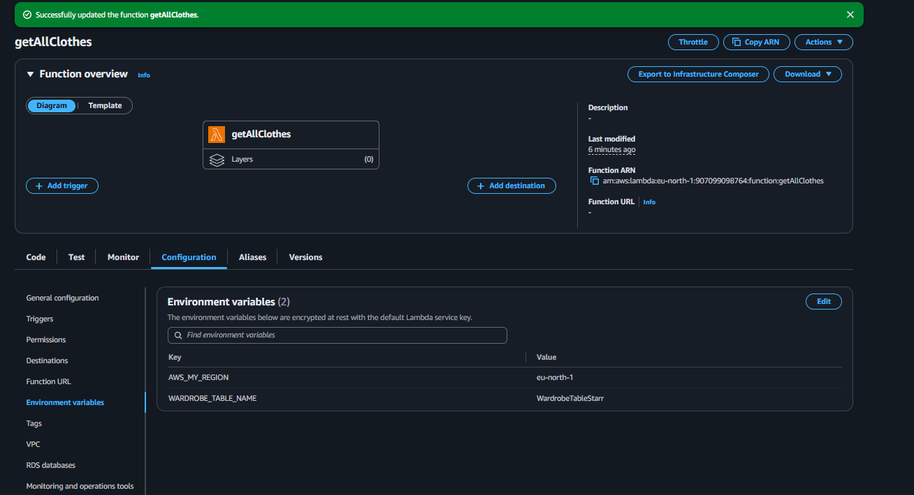
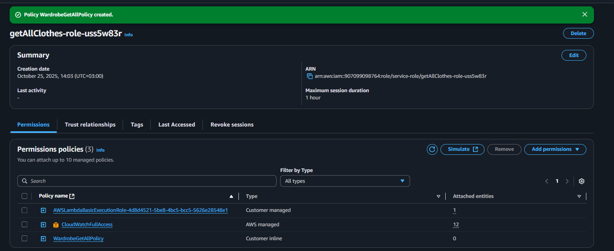

# Lambda Setup | [← Back to AWS README](/aws/README.md)

## Overview

This document explains how to set up AWS Lambda functions.
AWS Lambda is a **serverless compute service** that lets you run code without provisioning or managing servers.

Each Lambda function is assigned an IAM role that defines which AWS services it can access. This is managed through **IAM policies** — always designed following the **Principle of Least Privilege** .

---

## My Structure

### Lambda Functions for Clothes

- [WardrobeGetAll](./lambda/clothes/WardrobeGetAll.mjs)

  - Policy: [WardrobeGetAllPolicy](./policy/clothes/wardrobeGetAllPolicy.json) — allows access to DynamoDB

- [WardrobeGetItem](./lambda/clothes/WardrobeGetItem.mjs)

  - Policy: [WardrobeGetItemPolicy](./policy/clothes/wardrobeGetItemPolicy.json) — allows access to DynamoDB

- [WardrobeCreateClothes](./lambda/clothes/WardrobeCreateClothes.mjs)

  - Policy: [WardrobeCreateClothesPolicy](./policy/clothes/wardrobeCreatePolicy.json) — allows access to DynamoDB, S3, and Rekognition

- [WardrobeDeleteClothes](./lambda/clothes/WardrobeDeleteClothes.mjs)

  - Policy: [WardrobeDeleteClothesPolicy](./policy/clothes/wardrobeDeletePolicy.json) — allows access to DynamoDB and S3

- [WardrobeEditClothes](./lambda/clothes/WardrobeEditClothes.mjs)

  - Policy: [WardrobeEditClothesPolicy](./policy/clothes/wardrobeEditPolicy.json) — allows access to DynamoDB, S3, and Rekognition

---

### Lambda Functions for Outfits

- [OutfitGetAll](./lambda/outfits/WardrobeGetAll.mjs)

  - Policy: [OutfitGetAllPolicy](./policy/outfits/wardrobeGetAllPolicy.json) — allows access to DynamoDB

- [OutfitGetItem](./lambda/outfits/WardrobeGetDetailOutfit.mjs)

  - Policy: [OutfitGetItemPolicy](./policy/outfits/wardrobeGetItemPolicy.json) — allows access to DynamoDB

- [OutfitCreateOutfit](./lambda/outfits/WardrobeCreateOutfit.mjs)

  - Policy: [OutfitCreateOutfitPolicy](./policy/outfits/wardrobeCreatePolicy.json) — allows access to DynamoDB

- [OutfitDeleteOutfit](./lambda/outfits/WardrobeDeleteOutfit.mjs)

  - Policy: [OutfitDeleteOutfitPolicy](./policy/outfits/wardrobeDeletePolicy.json) — allows access to DynamoDB

- [OutfitEditOutfit](./lambda/outfits/WardrobeEditOutfit.mjs)

  - Policy: [OutfitEditOutfitPolicy](./policy/outfits/wardrobeEditPolicy.json) — allows access to DynamoDB

> 💡 **Note:** Remember to replace placeholders like `<<bucket-name>>`, `<<region>>`, `<<account-id>>`, `<<wardrobe-table-name>>`, and `<<outfit-table-name>>` in your IAM policies with your actual AWS resource names before deployment.
>
> ⚠️ **Why so many custom policies?** Because of the **Least Access Principle** — each Lambda function should have _only_ the permissions it needs.

---

## Create Your First Lambda Function

We’ll start simple — creating a Lambda that retrieves all clothes from a DynamoDB table. Once you understand this process, you can easily build other Lambda functions using the same pattern.

1. Go to the [AWS Lambda Console](https://console.aws.amazon.com/lambda/home).
2. Click **“Create function.”**
3. Name your function (for example, `getAllClothes`).
4. Set the **Runtime** to `Node.js 22.x`.
5. Leave all other options as default and let AWS create a new execution role automatically.

---

### Add the Code and Environment Variables

1. After your function is created, scroll down to the **Code** section.
2. Copy the code from [WardrobeGetAll.mjs](./lambda/clothes/WardrobeGetAll.mjs) and paste it into the editor.
3. Click **Deploy** to save your changes.
4. Next, go to the **Configuration** tab → **Environment variables** and add:

   - `WARDROBE_TABLE_NAME` → Your DynamoDB table name (e.g., `WardrobeTableStarr`)
   - `AWS_MY_REGION` → Your AWS region (e.g., `eu-north-1`)

> 💡 At the end, your environment variables should look like this:
> 

---

### Attach IAM Policy to Lambda Role

For this Lambda function, we’ll first attach `CloudWatchLogsFullAccess` for debugging, and then create a **custom policy** for DynamoDB access.

1. On your Lambda function page, open the **Configuration** tab → **Permissions**.
2. Under **Execution role**, click the role name (this opens the IAM role in a new tab).
3. In the **Permissions policies** section, click **Add permissions** → **Attach policies**.
4. Search for `CloudWatchFullAccess`, select it, and click **Attach policies**.
5. Next, create a custom IAM policy for your DynamoDB table:

   - Click **Add permissions** → **Create inline policy**.
   - Switch to the **JSON** editor.
   - Copy the code from [wardrobeGetAllPolicy.json](./policy/clothes/wardrobeGetAllPolicy.json) and paste it there.

> ⚠️ Replace the placeholders `<<region>>`, `<<account-id>>`, and `<<wardrobe-table-name>>` with your actual AWS details.
> You can also find the correct ARN by opening your DynamoDB table and copying it from the **Table details** section.
>
> Here’s an example of what your policy should look like:

```json
{
  "Version": "2012-10-17",
  "Statement": [
    {
      "Sid": "QueryWardrobeItems",
      "Effect": "Allow",
      "Action": ["dynamodb:Query"],
      "Resource": "arn:aws:dynamodb:eu-north-1:123456789012:table/WardrobeTableStarr"
    }
  ]
}
```

> 💡 **Tip:** If you’re granting access to an S3 bucket, append `/*` to the end of the ARN to allow access to all objects in that bucket.

6. Click **Review policy**, name it (for example, `WardrobeGetAllPolicy`), and click **Create policy**.

> Your Lambda function now has permission to query items from your DynamoDB table.
> 

---

## Final Steps

**Congratulations!** You’ve successfully created and configured your first AWS Lambda function with the required IAM policies.
You can now test it directly from the AWS console and monitor its execution using **CloudWatch Logs**.

> ⚠️ **Very Important:** Don’t forget to add a trigger (e.g., API Gateway) so your Lambda can be invoked.
> If you haven’t done that yet, refer to the [API Gateway Setup](/aws/APIGatewaySetup.md) — see the **“Add Integrations”** section.
